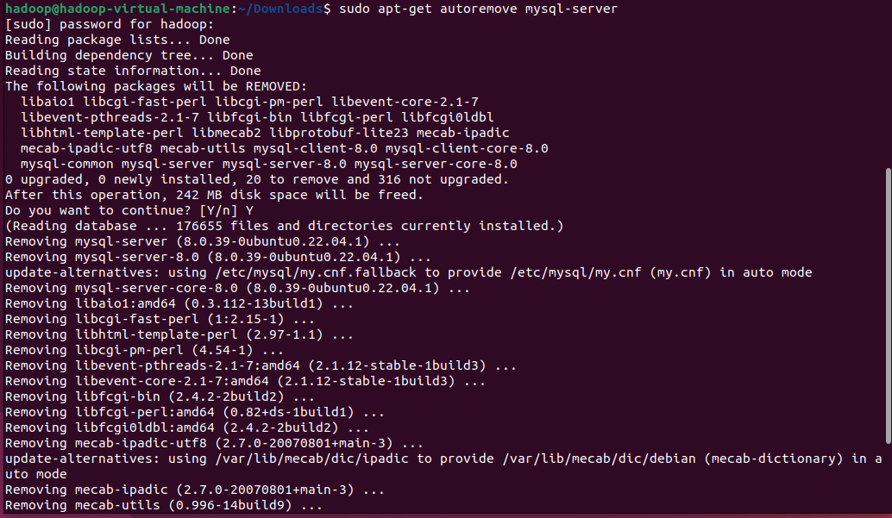

# 实验3  Mysql安装与使用
> 前言：数据库软件几乎是所有软件公司都必不可少的工具，无论是作为其软件产品的一部分，还是公司内容系统，都要用到的技术，mysql由于其免费开源的特点，深受各大公司的喜爱。

## 〖实验性质〗

验证型

## 〖实验目的〗

1、掌握Mysql安装

2、掌握常用sql语句使用

## 〖实验环境及工具〗

1、Linux

2、Mysql

## 〖实验内容〗

### 一、Mysql安装

sudo dpkg --configure -a

Sudo apt-get autoremove mysql-server

Sudo apt-get install mysql-server

查看mysql-server状态

### 二、Mysql使用

1.进入 Mysql-shell
   Mysql -u root -p  

系统会提示输入mysql 数据库root用户的密码，本例中密码是123456.

2.Mysql常用操作

(1)显示数据库

Show databases;

(2)使用数据库

Use mysql;

(3)显示数据库中的表

   Show tables;

(4)显示数据表的结构

Desc 表名;

(5)查询表中的记录

    Select * from 表名;

(6)创建数据库

    Create database 库名;

(7)创建表

Create table 表名（字段列表） ;

例子：create table student( id int(6) auto_increment not null primary key, xuehao int(10), xingming varchar(10), rxnf varchar(4), zy varchar(10)  );

Create table achievements( kcid int(6) not null , xueqi varchar(6) not null , xuehao int(10) not null, score double(4,2), primary key(kcid, xueqi, xuehao)  ) ;

(8)新增记录

增加学生信息。

insert into student values(null,1910540017, 'dfa',  '2021', '大数据');
insert into student values(null,1911630025, 'dfs',  '2021', '大数据');
insert into student values(null,1911630058, 'kel',  '2021', '大数据');
insert into student values(null,2110105139, 'ldx',  '2021', '大数据');
insert into student values(null,2111002088, 'lby',  '2021', '大数据');
insert into student values(null,2111601001, 'xdq',  '2021', '大数据');
insert into student values(null,2111601003, 'xfd',  '2021', '大数据');
insert into student values(null,2111601005, 'lpf',  '2021', '大数据');
insert into student values(null,2111601007, 'pdk',  '2021', '大数据');
insert into student values(null,2111601009, 'pox',  '2021', '大数据');
insert into student values(null,2111601011, 'dkw',  '2021', '大数据');
insert into student values(null,2111601013, 'xlq',  '2021', '大数据');
insert into student values(null,2111601015, 'xgq',  '2021', '大数据');
insert into student values(null,2111601017, 'kxk',  '2021', '大数据');
insert into student values(null,2111601019, 'gdq',  '2021', '大数据');
insert into student values(null,2111601023, 'qsx',  '2021', '大数据');
insert into student values(null,2111601027, 'pld',  '2021', '大数据');
insert into student values(null,2111601029, 'mbn',  '2021', '大数据');
insert into student values(null,2111601031, 'nbb',  '2021', '大数据');
insert into student values(null,2111601033, 'yjk',  '2021', '大数据');
insert into student values(null,2111601035, 'css',  '2021', '大数据');
insert into student values(null,2111601037, 'zdd',  '2021', '大数据');
insert into student values(null,2111601039, 'faa',  '2021', '大数据');
insert into student values(null,2111601041, 'wqq',  '2021', '大数据');
insert into student values(null,2111601043, 'zzd',  '2021', '大数据');
insert into student values(null,2111601045, 'tad',  '2021', '大数据');
insert into student values(null,2111601051, 'axd',  '2021', '大数据');
insert into student values(null,2111601053, 'zdf',  '2021', '大数据');
insert into student values(null,2111601057, 'cgd',  '2021', '大数据');
insert into student values(null,2111601059, 'mjh',  '2021', '大数据');
insert into student values(null,2111601061, 'wyj',  '2021', '大数据');
insert into student values(null,2111601065, 'zhq',  '2021', '大数据');
insert into student values(null,2111601067, 'lrh',  '2021', '大数据');
insert into student values(null,2111601069, 'xyq',  '2021', '大数据');
insert into student values(null,2111601071, 'rkd',  '2021', '大数据');
insert into student values(null,2111601073, 'zdd',  '2021', '大数据');

增加课程成绩。

insert into achievements value(2910412,'202101', 1910540017,    81 );
insert into achievements value(2910412,'202101', 1911630025,    23 );
insert into achievements value(2910412,'202101', 1911630058,    69 );
insert into achievements value(2910412,'202101', 2110105139,    50 );
insert into achievements value(2910412,'202101', 2111002088,    22 );
insert into achievements value(2910412,'202101', 2111601001,    29 );
insert into achievements value(2910412,'202101', 2111601003,    56 );
insert into achievements value(2910412,'202101', 2111601005,    77 );
insert into achievements value(2910412,'202101', 2111601007,    88 );
insert into achievements value(2910412,'202101', 2111601009,    75 );
insert into achievements value(2910412,'202101', 2111601011,    29 );
insert into achievements value(2910412,'202101', 2111601013,    64 );
insert into achievements value(2910412,'202101', 2111601015,    24 );
insert into achievements value(2910412,'202101', 2111601017,    62 );
insert into achievements value(2910412,'202101', 2111601019,    26 );
insert into achievements value(2910412,'202101', 2111601023,    6 );
insert into achievements value(2910412,'202101', 2111601027,    33 );
insert into achievements value(2910412,'202101', 2111601029,    78 );
insert into achievements value(2910412,'202101', 2111601031,    75 );
insert into achievements value(2910412,'202101', 2111601033,    53 );
insert into achievements value(2910412,'202101', 2111601035,    64 );
insert into achievements value(2910412,'202101', 2111601037,    47 );
insert into achievements value(2910412,'202101', 2111601039,    95 );
insert into achievements value(2910412,'202101', 2111601041,    15 );
insert into achievements value(2910412,'202101', 2111601043,    12 );
insert into achievements value(2910412,'202101', 2111601045,    0 );
insert into achievements value(2910412,'202101', 2111601051,    59 );
insert into achievements value(2910412,'202101', 2111601053,    60 );
insert into achievements value(2910412,'202101', 2111601057,    26 );
insert into achievements value(2910412,'202101', 2111601059,    91 );
insert into achievements value(2910412,'202101', 2111601061,    42 );
insert into achievements value(2910412,'202101', 2111601065,    99 );
insert into achievements value(2910412,'202101', 2111601067,    69 );
insert into achievements value(2910412,'202101', 2111601069,    67 );
insert into achievements value(2910412,'202101', 2111601071,    39 );
insert into achievements value(2910412,'202101', 2111601073,    71 );

insert into achievements value(1930446,'202101', 1910540017,    72 );
insert into achievements value(1930446,'202101', 1911630025,    36 );
insert into achievements value(1930446,'202101', 1911630058,    88 );
insert into achievements value(1930446,'202101', 2110105139,    81 );
insert into achievements value(1930446,'202101', 2111002088,    23 );
insert into achievements value(1930446,'202101', 2111601001,    75 );
insert into achievements value(1930446,'202101', 2111601003,    44 );
insert into achievements value(1930446,'202101', 2111601005,    54 );
insert into achievements value(1930446,'202101', 2111601007,    33 );
insert into achievements value(1930446,'202101', 2111601009,    37 );
insert into achievements value(1930446,'202101', 2111601011,    3 );
insert into achievements value(1930446,'202101', 2111601013,    65 );
insert into achievements value(1930446,'202101', 2111601015,    72 );
insert into achievements value(1930446,'202101', 2111601017,    74 );
insert into achievements value(1930446,'202101', 2111601019,    87 );
insert into achievements value(1930446,'202101', 2111601023,    16);
insert into achievements value(1930446,'202101', 2111601027,    7 );
insert into achievements value(1930446,'202101', 2111601029,    84 );
insert into achievements value(1930446,'202101', 2111601031,    92 );
insert into achievements value(1930446,'202101', 2111601033,    2 );
insert into achievements value(1930446,'202101', 2111601035,    40 );
insert into achievements value(1930446,'202101', 2111601037,    62 );
insert into achievements value(1930446,'202101', 2111601039,    19 );
insert into achievements value(1930446,'202101', 2111601041,    80 );
insert into achievements value(1930446,'202101', 2111601043,    100 );
insert into achievements value(1930446,'202101', 2111601045,    42);
insert into achievements value(1930446,'202101', 2111601051,    70 );
insert into achievements value(1930446,'202101', 2111601053,    59 );
insert into achievements value(1930446,'202101', 2111601057,    94 );
insert into achievements value(1930446,'202101', 2111601059,    100 );
insert into achievements value(1930446,'202101', 2111601061,    54 );
insert into achievements value(1930446,'202101', 2111601065,    64 );
insert into achievements value(1930446,'202101', 2111601067,    45 );
insert into achievements value(1930446,'202101', 2111601069,    96 );
insert into achievements value(1930446,'202101', 2111601071,    88 );
insert into achievements value(1930446,'202101', 2111601073,    83 );

(9)修改记录

   Update student set rxnf=’2022’ where xingming=’zss’;

(10)删除记录

    Delete from student where xingming =’czz’ ;

(11)删除数据库和表

Drop table student ;

Drop database test;

### 三、作业：

1.创建数据库 test;

2.创建表 student， 包含字段有 学号、姓名、入学年份、专业。

3.在student表中插入数据，你的学号，姓名，入学年份，专业。

4.创建表 achievements ， 包含字段 课程id，学期，学号，分数。

5.在achievements表中插入数据，你2门课的课程id、学期、学号、分数。

6.查看你插入的数据是否成功

7.修改你的课程成绩，查看是否修改成功。 

8.查询成绩排名，每门课都按成绩从高到低排序。

9.查询总成绩排名，总成绩按从高到低排序。按 学号、姓名、总成绩 输出结果。

### 四、附：Sql命令

1.数据库相关

CREATE DATABASES 数据库名称;	创建数据库

DROP DATABASE 数据库名;	删除数据库

show databases;	显示所有数据库

show tables;	显示当前数据库所有表

ALTER DATABASE 数据库名 DEFAULT CHARACTER SET 字符集名称;	更改数据库字符集

2.表相关

CREATE TABLE 表名(列名 类型 [属性],列名 类型 [属性]…); //属性可省略	创建表

DROP TABLE 表名;	删除表

ALTER TABLE 表名 ADD 列名 类型;	添加列

ALTER TABLE 表名 DROP COLUMN 列名;	删除列

show columns from 表名;	显示表中所有列

select * from 表名;	显示表中所有数据

3.数据相关

INSERT INTO 表名 VALUES(值,值,值…); //默认添加顺序为该表的列名顺序	添加数据

DELETE FROM 表名 WHERE 条件;	删除数据

IPDATE 表名 SET 列名=值 WHERE 条件;	修改数据

4.Sql 练习

创建数据库与表

上面已经创建了数据库：

create database test; 

使用该数据库：
use test;

再在该数据库中创建一张表：
create table stu(name char(20),age int,sex char,phono char(11));

查看表
show tables;

查看表中有哪些列：
show columns from stu;

向表中添加数据：
insert into stu values('ming',10,'1','10202020'),('zeng',20,'0','1390120'),('qiang',15,'1','9237133'),('hong',13,'0','1342432');

由于该shell对中文支持不友好，所以就用字母了，如果用cmd登录的话，可以使用中文的
查看该表中所有的数据：

显示年龄小于15，性别为男的数据
select * from stu where age<15 and sex='1';

还有其它很多命令，也可以这样自己练习，只有将这些指令用熟练之后，才方便日后编程中使用
