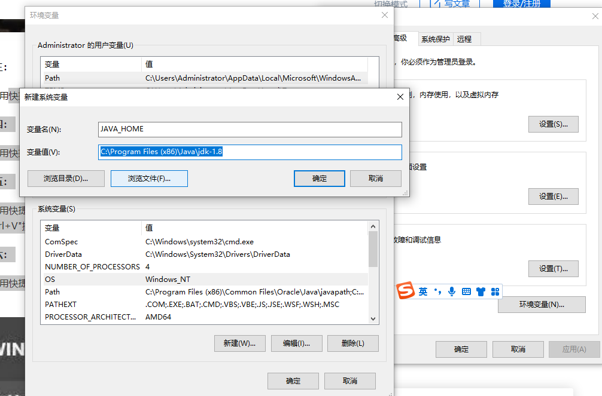
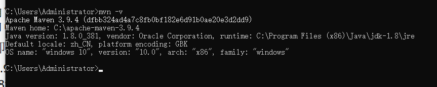
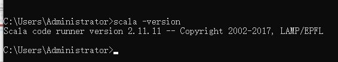
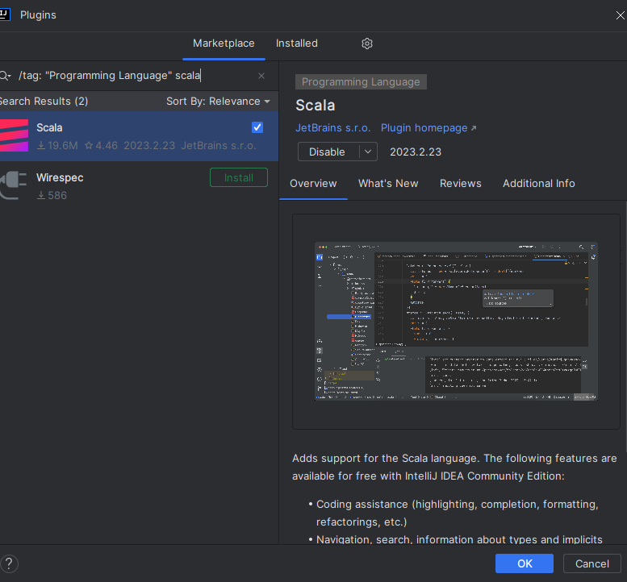
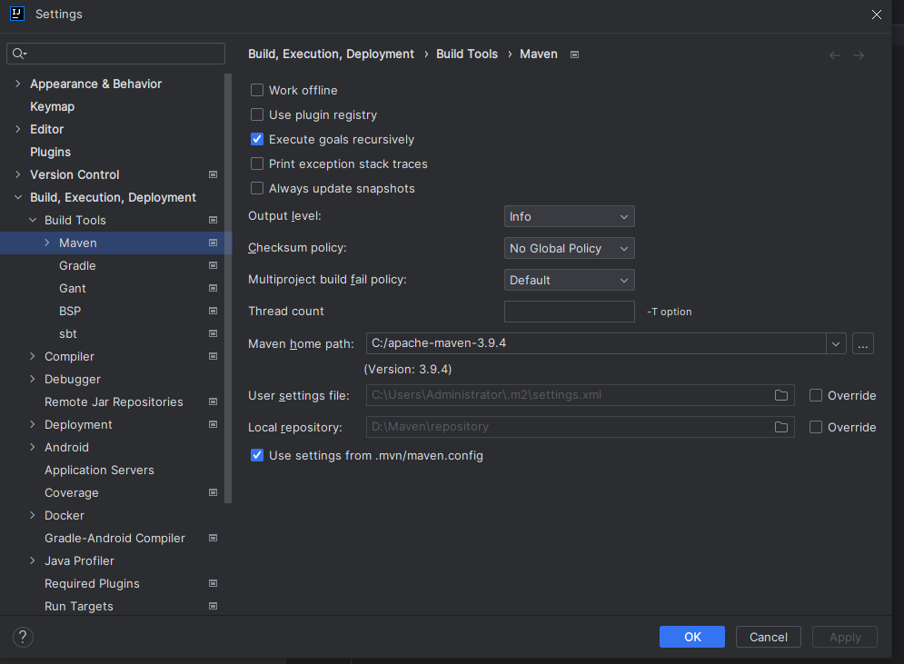

# intellij Idea安装配置
> IntelliJ IDEA是一款由JetBrains公司开发的集成开发环境（IDE），专门用于Java语言开发。这款工具因其强大的功能和用户友好的界面而被广泛认为是最好的Java开发工具之一。JetBrains公司总部位于捷克共和国的首都布拉格，并且以其严谨和专业的东欧程序员团队而著称。IntelliJ IDEA提供了智能代码助手、代码自动提示、重构、JavaEE支持、版本控制工具集成（如Git和SVN）、JUnit测试框架支持、CVS整合、代码分析以及创新的GUI设计等功能，这些功能使得IntelliJ IDEA在开发Java应用程序时极为高效和便捷。

## 〖实验性质〗
 
 验证型

## 〖实验目的〗

1、掌握idea的安装配置方法

## 〖实验环境及工具〗

1、windows

2、IDEA

## 〖实验内容〗

### 一、Java-windows环境配置

0.前置检查，本机是否安装jdk： 右键左下角窗口图标-点击运行，输入cmd 回车，弹出控制台窗口。窗口中输入 java -version 回车。 
如返回  'java' 不是内部或外部命令，也不是可运行的程序或批处理文件。或 Java版本 不是 1.8 字样， 则需安装jdk 1.8。

1.下载地址：https://www.oracle.com/java/technologies/downloads/#java8
选取Windows 环境的对应 EXE 文件进行下载。 如jdk-8u381-windows-x64.exe 。

2.双击 jdk-8u381-windows-x64.exe 进行安装 。安装目录可以不做修改，但要记住安装目录。如 C:\Program Files\Java\jdk-1.8

3.环境变量修改。

右键点击“此电脑”，选择属性，选择高级系统设置

点击环境变量，点击 系统变量--新建，输入变量名JAVA_HOME，变量值为JDK的安装根目录所在路径。

选择系统变量，找到Path变量，点击编辑。 点击新建，输入%JAVA_HOME%\bin，点击确定。



4.检查jdk是否配置正常。

右键左下角窗口图标-点击运行，弹出控制台窗口。窗口中输入 java -version 回车。返回如下内容即配置成功：


### 二、maven -Windows 环境配置

0.前置检查，本机是否安装maven： 右键左下角窗口图标-点击运行，输入cmd 回车，弹出控制台窗口。窗口中输入 mvn -version 回车。 如返回  'mvn' 不是内部或外部命令，也不是可运行的程序或批处理文件,则需安装mvn。

1.下载maven：下载地址：https://maven.apache.org/download.cgi

选取Windows 环境的对应 zip文件进行下载。 如apache-maven-3.9.4-bin.zip 。


2.解压：右键 apache-maven-3.9.4-bin.zip 文件，解压缩到指定目录，如C:\apache-maven-3.9.4。 

3.配置maven。

(1)点击 此电脑，在D盘下 创建文件夹 D:\Maven\repository

(2) 进入安装目录下C:\apache-maven-3.9.4\conf\ 。 以下2种方式2选1。
  1. 用给你的settings.xml 文件替换该路径下的settings.xml文件
  2. 编辑 settings.xml文件，找到 <mirrors> .... </mirrors> 内容，
     把<mirror>...</mirror> 内容替换为以下
```xml
   
<mirror>
    <id>alimaven</id>
    <name>aliyun maven</name>
    <url>http://maven.aliyun.com/nexus/content/groups/public/</url>
    <mirrorOf>central</mirrorOf>
</mirror>

```


4.配置环境变量

(1)点击环境变量，点击 系统变量--新建，输入变量名MAVEN_HOME，变量值为maven的安装根目录所在路径。如 C:\apache-maven-3.9.4 。

(2)选择系统变量，找到Path变量，点击编辑。 点击新建，输入%MAVEN_HOME%\bin，点击确定。

5.检查maven是否配置成功：

(1)右键左下角窗口图标-点击运行，输入cmd 回车，弹出控制台窗口。窗口中输入 mvn -v  回车。

(2)返回如下内容 即 配置成功。 



### 三、Scala环境配置

0.下载地址：https://www.scala-lang.org/download/2.11.11.html

1.选取Windows 环境的对应 zip文件进行下载。 如scala-2.11.11-zip 。


2.右键 scala-2.11.11-zip  文件，解压缩到指定目录，如C:\scala-2.11.11。 

3.配置环境变量

点击环境变量，点击 系统变量--新建，输入变量名SCALA_HOME，变量值为scala的安装根目录所在路径。如 C:\scala-2.11.11 。

选择系统变量，找到Path变量，点击编辑。 点击新建，输入%SCALA_HOME%\bin，点击确定。

4.检查scala 是否安装成功

右键左下角窗口图标-点击运行，输入cmd 回车，弹出控制台窗口。窗口中输入 scala -version  回车。返回如下内容 即 配置成功。 



### 四、Idea 安装与配置
0.idea 下载地址：https://www.jetbrains.com/zh-cn/idea/download/#section=windows ，得到文件ideaIU-2023.2.2.exe 。

1.idea破解安装  

2.破解安装流程见： https://www.kdocs.cn/l/cj3oN3RP30TF 

3.最后的激活码见：https://www.java-doc.cn/article/21

4.idea配置

5.打开 idea ，+ new  project。

6.安装scala插件：language: + Scala ，弹出如右侧对话框，点击install。



7.配置jdk， 选取之前安装的jdk所在的根目录。

8.配置scala sdk， 选取之前安装的scala 所在根目录。


9.配置maven，

点击File-Settings-Maven home path：选择maven根目录。

user settings file:  选择maven 根目录下 conf目录下settings.xml 文件。



## 〖课后实验作业〗

在自己电脑上重复本实验所有安装过程。
