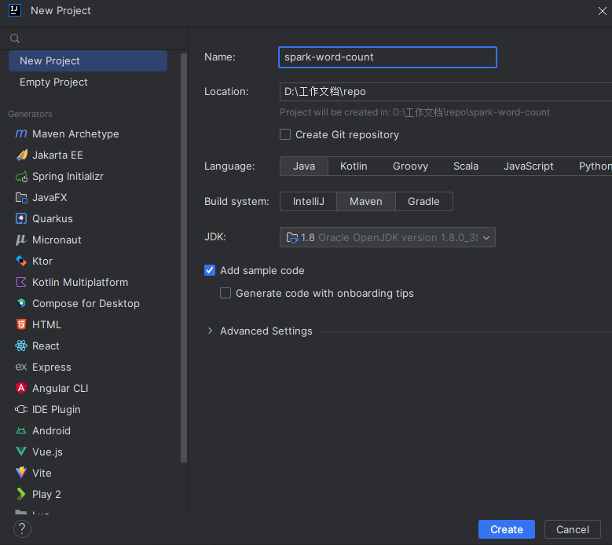
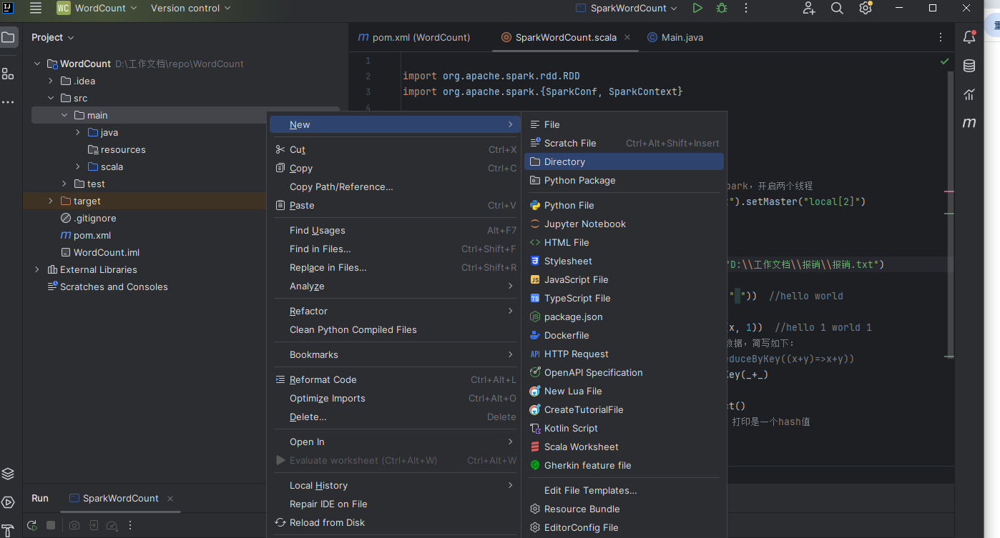
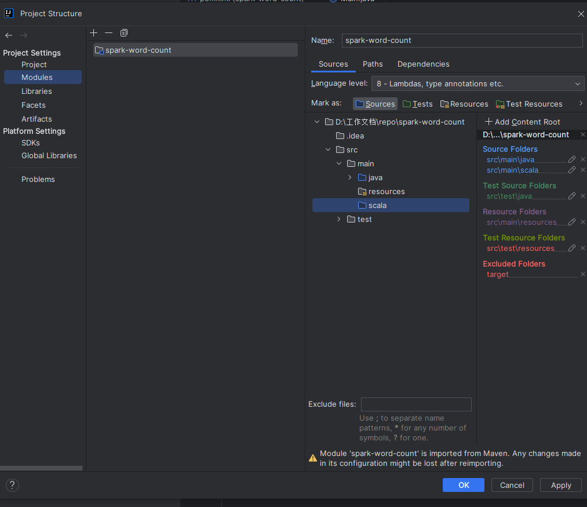
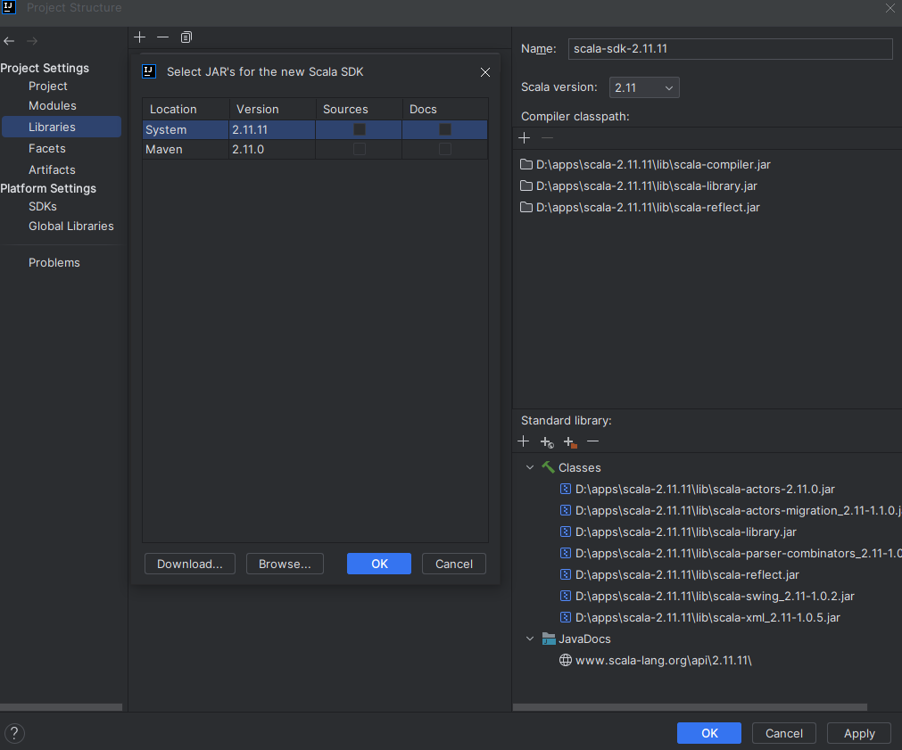
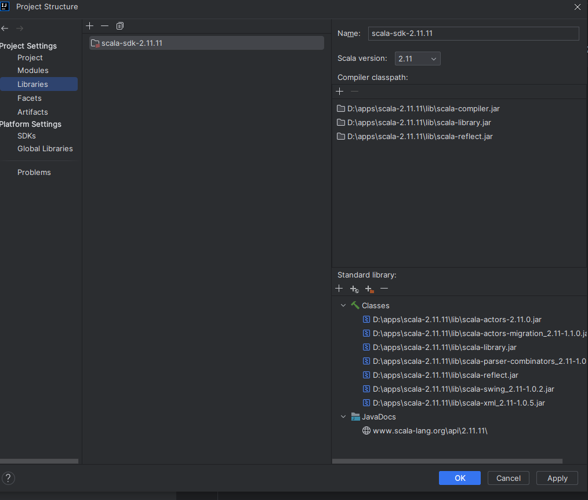
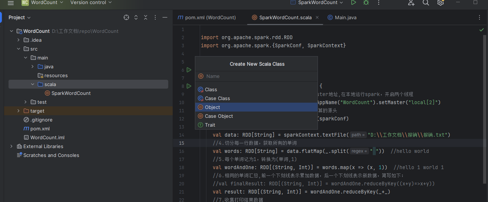

# spark工程环境搭建
> IntelliJ IDEA是一款由JetBrains公司开发的集成开发环境（IDE），专门用于Java语言开发。利用idea搭建基于spark的工程项目代码是很常用的手段，便于后续的代码开发。
## 〖实验性质〗

 验证型
## 〖实验目的〗

1、掌握idea上spark工程的搭建

## 〖实验环境及工具〗

1、windows

2、IDEA

## 〖实验内容〗

### 一、IDEA开发spark的 WordCount程序

步骤一：创建Maven项目


  
 在左侧边栏中，找到 WordCount-src-main, 点击右键-new-directory, 输入 scala  回车。


 
 在左上顶部左键点击  file-Project Structure， 在Project Settings-Modules 下，在右侧视图中找到 src-main-scala， 选中后点击上部蓝色 Sources 图标，点击后，scala 这个文件夹符号 就会变成蓝色。


 

 增加 Scala-sdk 到该项目 

 
 


步骤二：编写代码
1. 编写 wordcount 代码
  
   在 左侧边栏 找到 WordCount-src-main-scala, 其上点击右键-new-Scala Class. 在弹出的对话框中，输入 SparkWordCount , 其下栏选择 Object, 回车。



```scala

import org.apache.spark.rdd.RDD
import org.apache.spark.{SparkConf, SparkContext}


object SparkWordCount {

  def main(args: Array[String]): Unit = {
    //1.创建SparkConf对象，设置appName和Master地址,在本地运行spark，开启两个线程
    val sparkConf = new SparkConf().setAppName("WordCount").setMaster("local[2]")
    //2.创建SparkContext对象，他是所有任务计算的源头
    val sparkContext = new SparkContext(sparkConf)
    //3.读取数据文件,RDD简单理解为一个集合
    val data: RDD[String] = sparkContext.textFile("D:\\工作文档\\test.txt")
    //4.切分每一行数据，获取所有的单词
    val words: RDD[String] = data.flatMap(_.split(" "))  //hello world
    //5.每个单词记为1，转换为(单词,1)
    val wordAndOne: RDD[(String, Int)] = words.map(x => (x, 1))  //hello 1 world 1
    //6.相同的单词汇总,前一个下划线表示累加数据，后一个下划线表示新数据，简写如下：
    //val finalResult: RDD[(String, Int)] = wordAndOne.reduceByKey((x+y)=>x+y))
    val result: RDD[(String, Int)] = wordAndOne.reduceByKey(_+_)
    //7.收集打印结果数据
    val finalResult: Array[(String, Int)] = result.collect()
    //toBuffer使定长数据打印成不定长数组，finalResult是一个数组，打印是一个hash值
    println(finalResult.toBuffer)
    //8.关闭sparkContext对象
    sparkContext.stop()

  }
}


```

2. 配置pom， 引入必要的依赖包
   点击左侧边栏，项目WordCount目录下的 pom.xml， 编辑如下内容
```xml
<?xml version="1.0" encoding="UTF-8"?>
<project xmlns="http://maven.apache.org/POM/4.0.0"
         xmlns:xsi="http://www.w3.org/2001/XMLSchema-instance"
         xsi:schemaLocation="http://maven.apache.org/POM/4.0.0 http://maven.apache.org/xsd/maven-4.0.0.xsd">
    <modelVersion>4.0.0</modelVersion>

    <groupId>org.example</groupId>
    <artifactId>WordCount</artifactId>
    <version>1.0-SNAPSHOT</version>

    <properties>
        <maven.compiler.source>8</maven.compiler.source>
        <maven.compiler.target>8</maven.compiler.target>
        <project.build.sourceEncoding>UTF-8</project.build.sourceEncoding>
        <spark.version>2.1.0</spark.version>
        <scala.version>2.11</scala.version>
    </properties>

    <dependencies>
        <dependency>
            <groupId>org.scala-lang</groupId>
            <artifactId>scala-library</artifactId>
            <version>2.11.11</version> <!-- 请使用你需要的Scala版本 -->
        </dependency>
        <dependency>
            <groupId>org.apache.spark</groupId>
            <artifactId>spark-core_${scala.version}</artifactId>
            <version>${spark.version}</version>
        </dependency>
        <dependency>
            <groupId>org.apache.spark</groupId>
            <artifactId>spark-streaming_${scala.version}</artifactId>
            <version>${spark.version}</version>
        </dependency>
        <dependency>
            <groupId>org.apache.spark</groupId>
            <artifactId>spark-sql_${scala.version}</artifactId>
            <version>${spark.version}</version>
        </dependency>
        <dependency>
            <groupId>org.apache.spark</groupId>
            <artifactId>spark-hive_${scala.version}</artifactId>
            <version>${spark.version}</version>
        </dependency>
        <dependency>
            <groupId>org.apache.spark</groupId>
            <artifactId>spark-mllib_${scala.version}</artifactId>
            <version>${spark.version}</version>
        </dependency>
    </dependencies>
    <build>
        <plugins>
            <plugin>
                <groupId>org.scala-tools</groupId>
                <artifactId>maven-scala-plugin</artifactId>
                <version>2.15.2</version>
                <executions>
                    <execution>
                        <goals>
                            <goal>compile</goal>
                            <goal>testCompile</goal>
                        </goals>
                    </execution>
                </executions>
            </plugin>
            <plugin>
                <artifactId>maven-compiler-plugin</artifactId>
                <version>3.6.0</version>
                <configuration>
                    <source>1.8</source>
                    <target>1.8</target>
                </configuration>
            </plugin>
            <plugin>
                <groupId>org.apache.maven.plugins</groupId>
                <artifactId>maven-surefire-plugin</artifactId>
                <version>2.19</version>
                <configuration>
                    <skip>true</skip>
                </configuration>
            </plugin>
        </plugins>
    </build>
</project>
```
  再右键-Maven-reload project。

3. 执行 SparkWordCount.scala 代码。 
   选择SparkWordCount.scala 文件，右键-run "SparkWordCount"。 执行代码结果如下：
```shell
24/10/11 17:38:19 INFO DAGScheduler: Job 0 finished: collect at SparkWordCount.scala:23, took 0.234047 s
24/10/11 17:38:19 INFO SparkUI: Stopped Spark web UI at http://192.168.61.1:4040
24/10/11 17:38:19 INFO MapOutputTrackerMasterEndpoint: MapOutputTrackerMasterEndpoint stopped!
24/10/11 17:38:19 INFO MemoryStore: MemoryStore cleared
24/10/11 17:38:19 INFO BlockManager: BlockManager stopped
24/10/11 17:38:19 INFO BlockManagerMaster: BlockManagerMaster stopped
24/10/11 17:38:19 INFO OutputCommitCoordinator$OutputCommitCoordinatorEndpoint: OutputCommitCoordinator stopped!
24/10/11 17:38:19 INFO SparkContext: Successfully stopped SparkContext
24/10/11 17:38:19 INFO ShutdownHookManager: Shutdown hook called
24/10/11 17:38:19 INFO ShutdownHookManager: Deleting directory C:\Users\Administrator\AppData\Local\Temp\spark-a9e958e7-8112-4b0d-a3ae-1f8e6348f348
ArrayBuffer((IDEA是一款由JetBrains公司开发的集成开发环境（IDE），专门用于Java语言开发。利用idea搭建基于spark的工程项目代码是很常用的手段，便于后续的代码开发。,1), (IntelliJ,1))

 Process finished with exit code 0

```
