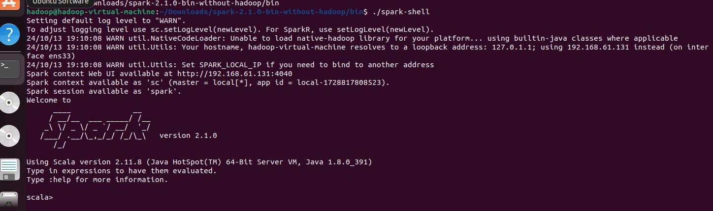
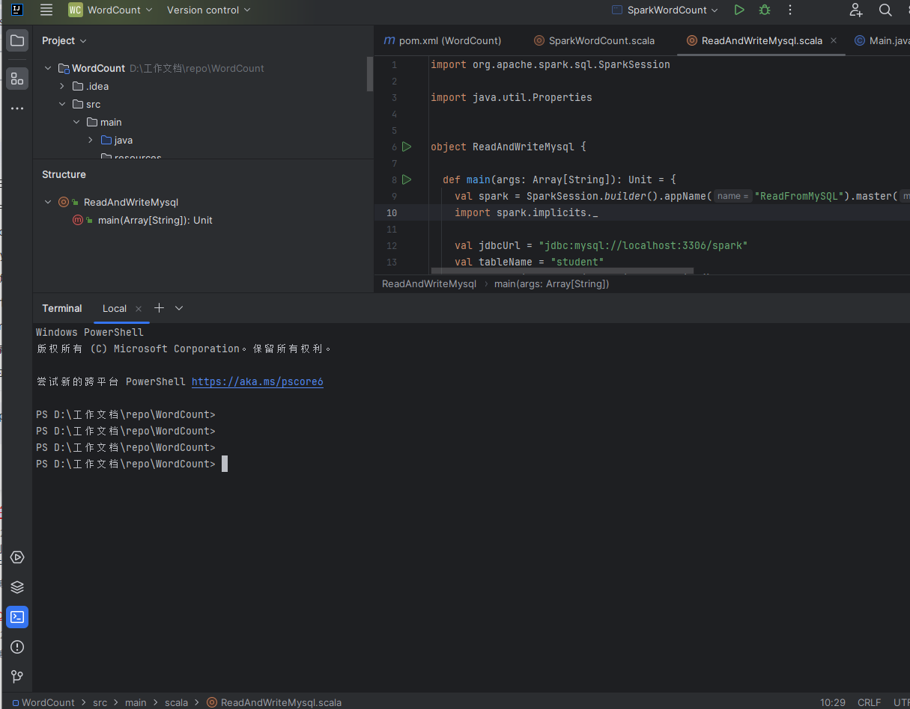
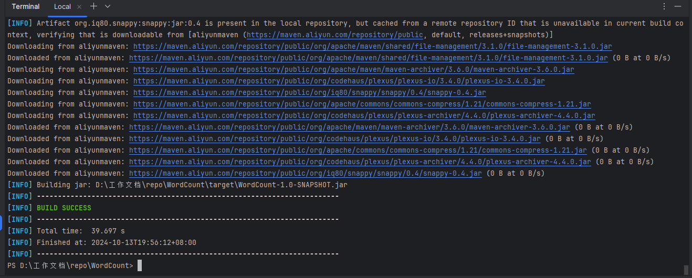

# spark工程搭建-mysql读写
> 众所周知，spark 是大数据的计算框架，数据的来源和保存有很多种，传统的数据库就是其中一种，且应用非常普遍，而Spark 也提供了读写 mysql 数据库的api，使用起来非常方便，所以学会如何用Spark 读写mysql数据库，在实际应用中是非常必要的。

## 〖实验性质〗
 
 验证型

## 〖实验目的〗

1、掌握idea的安装配置方法

## 〖实验环境及工具〗

1、windows

2、IDEA

## 〖实验内容〗
### 1．前置工作mysql 服务及数据准备

(1) 在Linux中启动MySQL数据库
```shell
$ service mysql start
$ mysql -u root -p
```
屏幕会提示你输入密码

(2) mysql建表
```mysql
mysql> create database spark;
mysql> use spark;
mysql> create table student (id int(4), name char(20), gender char(4), age int(4));
mysql> insert into student values(1,'Xueqian','F',23);
mysql> insert into student values(2,'Weiliang','M',24);
mysql> select * from student;
```
### 2. Spark-shell 读写mysql

(1) 启动Spark-shell 
``` shell
   cd ~/Downloads/spark-2.1.0-bin-without-hadoop/bin
   ./spark-shell
```


(2) 编写如下代码

```scala 
// 读数据库 spark的 student 表
import spark.implicits._

    val jdbcUrl = "jdbc:mysql://localhost:3306/spark"
    val tableName = "student"
    val properties = new java.util.Properties()
    properties.setProperty("user", "root")
    properties.setProperty("password", "123456")
    properties.setProperty("driver", "com.mysql.jdbc.Driver")
 
    // 读取MySQL表作为DataFrame
    val studentDF = spark.read.jdbc(jdbcUrl, tableName, properties)    

    studentDF.show()

    studentDF.createOrReplaceTempView("student")

    spark.sql("select * from student where name='Xueqian' ").show
    
    val insertRDD = spark.sparkContext.parallelize(Array("3 Rongcheng M 26","4 Guanhua M 27")).map(_.split(" ")).map( x => (x(0),x(1),x(2),x(3)) ).toDF("id","name","gender","age")

    insertRDD.createOrReplaceTempView("myRdd")

    val insertSQL = "SELECT * FROM myRdd "
    spark.sql(insertSQL).write.mode("append").jdbc(jdbcUrl, "student", properties )

    
    spark.read.jdbc(jdbcUrl, tableName, properties).show()   

```

### 3. spark 工程中读写 mysql

#### 3.1 代码编写

在idea 打开 Spark工程， 参考上一次实验，搭建Spark 工程。

例如在上一次实验中搭建的WordCount项目中， 在左侧工程目录，右键 WordCount-src-main-scala ，new-Scala Class , 在弹出的对话框中，类名填写 ReadAndWriteMysql 并下拉选择Object。

在 ReadAndWriteMysql.scala 文件中编写类似上面的代码。完整代码如下：

```scala
import org.apache.spark.sql.SparkSession

import java.util.Properties


object ReadAndWriteMysql {

  def main(args: Array[String]): Unit = {
    val spark = SparkSession.builder().appName("ReadFromMySQL").master("local[2]").getOrCreate()
    import spark.implicits._

    val jdbcUrl = "jdbc:mysql://localhost:3306/spark"
    val tableName = "student"
    val properties = new java.util.Properties()
    properties.setProperty("user", "root")
    properties.setProperty("password", "123456")
    properties.setProperty("driver", "com.mysql.jdbc.Driver")

    // 读取MySQL表作为DataFrame
    val studentDF = spark.read.jdbc(jdbcUrl, tableName, properties)

    studentDF.show()

    studentDF.createOrReplaceTempView("student")

    spark.sql("select * from student where name='Xueqian' ").show

    val insertRDD = spark.sparkContext.parallelize(Array("3 Rongcheng M 26", "4 Guanhua M 27")).map(_.split(" ")).map(x => (x(0), x(1), x(2), x(3))).toDF("id", "name", "gender", "age")

    insertRDD.createOrReplaceTempView("myRdd")


    val insertSQL = "SELECT * FROM myRdd "
    spark.sql(insertSQL).write.mode("append").jdbc(jdbcUrl, "student", properties)


    spark.read.jdbc(jdbcUrl, tableName, properties).show()
  }

}

```
#### 3.2 编译打包

(1) 打开控制台

   点击idea 左下的 Terminal 图标。

 

(2)  打包命令 

  mvn clean package

 

#### 3.3 运行 jar 包

将上一步产生的jar包 发送到 虚拟机上，然后运行命令。

/home/hadoop/Downloads/spark-2.1.0-bin-without-hadoop/bin/spark-submit --class ReadAndWriteMysql /home/hadoop/WordCount-1.0-SNAPSHOT.jar
 


