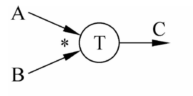
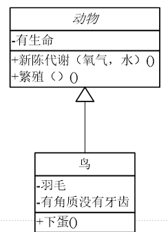
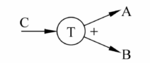
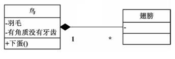
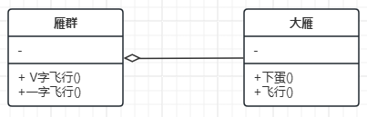
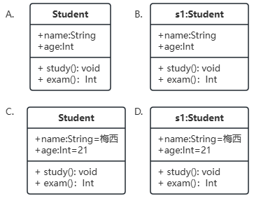

# 软件设计与工程相关专业练习题
## 一. 单选题
1. 完整的软件产品，不包括以下哪项______。	
A. 不同规模和体系结构的计算机上运行的程序          B. 程序运行过程中产生的各种结果     
C. 各种以硬拷贝或电子媒介的形式存在的描述信息       D. 浏览器
2. 以下不属于面向对象编程概念的是______。 
A. 封装    B. 继承    C. 多态    D. 用户界面
3. Open-Close原则的含义是一个软件实体______。 
A. 应当对扩展开放，对修改关闭.           B. 应当对修改开放，对扩展关闭  
C. 应当对继承开放，对修改关闭		   	    D. 以上都不对
4. 要依赖于抽象，不要依赖于具体。即针对接口编程，不要针对实现编程是______的表述。
A. 开-闭原则			    B. 接口隔离原则
C. 里氏代换原则		    D. 依赖倒转原则
5. 设计模式的两大主题是________。
A. 系统的维护与开发			  B. 对象组合与类的继承         
C. 系统架构与系统开发       D. 系统复用与系统扩展
6. 哪项不属于良好用户界面设计（UI）的原则？______。 
A. 一致性		B. 可点击区域小而密集		C. 反馈机制		D. 可识别性
7. 在云计算中，公共云指的是______。
A. 仅限内部员工使用的云服务   
B. 只提供基础设施服务的云      
C. 对公众开放且由服务提供商管理的云服务   
D. 由多个企业共同使用的云环境
8. 在观察者模式中，表述错误的是______。
A. 观察者角色的更新是被动的   
B. 被观察者可以通知观察者进行更新      
C. 观察者可以改变被观察者的状态，再由被观察者通知所有观察者依据被观察者的状态进行更新   
D. 观察者模式支持广播通信。
9. 下面数据流图中要输出C的话，A和B是________关系。 

A. 与	   B. 或    C. 异或    	D. 没有关系
10. 在下面的类关系图中，表达的是______关系。

A.聚合;  B. 合成;    C. 泛化;    D. 关联;

11. 以下不属于软件生命周期的是______。
A. 可行性分析    B. 需求分析    C. 用户体验    D. 系统测试
12. 以下不属于软件开发成本的是________。
A. 软硬件设备费用    B. 产品推广    C. 系统开发费用    D. 系统安装维护费用
13. 以下不是可行性分析的是________。
A. 技术可行性    B. 系统建模     C. 经济可行性    D. 社会可行性
14. 以下不是需求分析的特点的是________。
A. 需求易变    B. 问题复杂    C. 不完备和不一致    D. 搜集困难
15. 软件设计一般分为总体设计和详细设计，它们之间的关系是________。
A. 全局和局部    B. 抽象和具体    C. 总体和层次    D. 功能和结构
16. 在对数据流的分析中，主要是找到变换中性，这是从________导出结构图的关键。
A. 数据结构    B. 实体关系    C. 数据流图    D. E-R图
17. 程序控制一般分为________、分支和循环三种基本结构。
A. 分块    B. 顺序    C. 中断    D.  goto
18. 对象之间的动态联系用________表示。
A. 一般-特殊结构    B. 整体-部分结构    C. 实例连接    D. 消息连接
19. 以下哪项不属于软件测试________。
A. 黑盒测试    B. 白盒测试    C. 动态测试    D. 钓鱼测试
20. 软件工程学中除重视软件开发技术的研究外，另一重要组成内容是软件的________。
A. 工程管理    B. 成本核算    C. 人员培训    D. 工具开发
21. 为使得开发人员对软件产品的各阶段工作都进行周密的思考，减少返工，所以________的编制是很重要的。
A. 需求说明    B. 概要设计    C. 软件文档    D. 测试大纲
22. 进度表在项目早期的重要用途是________。
A. 确定项目成本    B. 沟通项目里程碑    C. 制定工作分解结构    D. 制定工期估算
23. 作为生产产品的载体，软件提供的功能，不包括以下哪项______。	
A. 计算机控制          B. 内存     
C. 信息通信             D. 应用程序开发和控制
24. 用于在软件设计中表达静态结构和组件关系的语言是______。
A. UML (Unified Modeling Language)    B. HTML (Hypertext Markup Language)    
C. XML (Extensible Markup Language)    D. SQL (Structured Query Language)
25. 在面向对象编程中，封装是指________。
A. 将相似的对象组合在一起			   B. 隐藏对象的内部状态和实现细节         
C. 继承一个类的行为到另一个类       D. 限制对象的访问权限
26. 以下哪个关键字用于创建一个类的新实例？_______。 
A. new   B. this     C. class     D. extends
27. 下面数据流图中，输出A和B是________关系。 

A. 与	   B. 或    C. 异或    	D. 没有关系

29. 在下面的类关系图中，表达的是______关系。

A. 聚合;  B. 合成;    C. 泛化;    D. 关联;

30. 软件生命周期模型有多种，下列选项中，________不是软件生命周期模型。
A. 螺旋模型    B. 增量模型    C. 功能模型    D. 瀑布模型
31. 在软件生命周期中，用户主要是在___________参与软件开发。
A. 软件定义期    B. 软件开发期    C. 软件维护期    D. 整个软件生命周期
32. 技术可行性要解决___________。
A. 存在侵权否    B. 成本-效益问题    C. 运行方式可行问题    D. 技术风险问题
33. 在结构化分析法中，用以表达系统内部数据的运行情况的工具是_________。
A. 数据流图    B. 数据字典    C. 结构化表达    D. 判定树

34. 在数据流图中，有名字及方向的成分是__________。

A. 控制流    B. 信息流    C. 数据流    D. 信号流

35. 在下面的类关系图中，表达的是______关系。

A. 聚合;  B. 合成;    C. 泛化;    D. 关联;

36.以下对象图画的正确的是____________。

37.以下类图画的正确的是____________。

38. 状态迁移图不包括以下______________。
A.对象的状态                     B. 外部激励的事件
C. 对象的抽象层次                 D. 初态和终态
39. 在UI设计中，以下____________项原则最能体现用户友好性。
A.灵活性                     B. 一致性
B.美观性                     D. 功能复杂性
40. 在UI设计的色彩选择中，哪种颜色最容易引起用户的注意？
A.蓝色                     B. 绿色
B.红色                     D. 灰色
41. 在UI设计中，什么是“信息架构”的主要作用？
A.提升视觉效果                     B. 定义用户与系统的交互方式
C. 组织和呈现内容，使其易于导航     D. 增加系统的安全性

42. 下列哪种设计方法可以有效减少用户的学习曲线？
A.隐藏所有高级功能                     B. 使用系统专用术语
C.采用直观的界面和熟悉的操作流程       D. 提供复杂的导航结构
43. 以下哪项原则是面向对象设计的核心思想？
A.多态性                              B. 抽象
C.继承                                D. 封装
44. 在面向对象设计中，表示对象内部数据的关键特性是？
A.方法                     B. 消息传递
C.属性                     D. 类
45. 在面向对象设计中，使用继承时，子类可以重写父类的方法，这个特性叫做：
A.抽象                     B. 多态
C.封装                     D. 继承
46. 面向对象设计中，类与对象之间的关系是？
A.对象是类的实例                     B. 类是对象的实例
C.类与对象无直接关系                 D. 类和对象是一样的
47. 下列哪种设计方法可以有效减少用户的学习曲线？
A.隐藏所有高级功能                     B. 使用系统专用术语
C.采用直观的界面和熟悉的操作流程       D. 提供复杂的导航结构
48. 以下哪种云计算服务模式提供的是完整的应用程序，用户只需使用而无需管理底层基础设施？
A. IaaS                    B. PaaS
C. SaaS                    D. DaaS
49. 在云计算中，负责在多个物理资源上分配虚拟资源的软件层称为
A. 中间件                    B. 虚拟化管理器
C. 负载均衡器                D. API网关
50.Hadoop框架中，负责分布式文件存储的组件是_______。
A. HDFS                    B. MapReduce
C. Hive                    D. HBase
51. 大数据中的“三高”特征不包括以下哪项？ 
A. 高可扩展性              B. 高容量
C. 高复杂性                D. 高速度
52. 以下哪种技术最适合处理海量流数据？ 
A. HDFS           B. Spark Streaming
C. MapReduce      D. RDBMS
53. 在云计算的IaaS服务模型中，用户主要负责以下哪项管理？
A. 网络基础设施                 B. 虚拟机的操作系统
C. 应用程序的开发和维护         D. 数据中心的物理硬件
54. 下列关于SaaS（软件即服务）的描述，正确的是：
A. SaaS是一种提供硬件资源的服务               B. SaaS需要用户管理和维护操作系统
C. SaaS允许用户通过互联网访问和使用应用程序   D. SaaS通常只提供基础设施，不提供软件
55. UML中用于描述系统动态行为的图不包括_______。
	A. 序列图     B. 类图
	C. 状态图     D. 活动图
56. 在UML中，表示“整体-部分”关系的是_________。
	A. 关联       B. 聚合
	C. 依赖  		D. 泛化
57. 用例图中的参与者（Actor）通常代表___________。
	A. 系统内部模块  		B. 系统外部用户或系统
C. 数据库实体			D. 控制流
58. 面向对象设计的核心思想不包括_______________。
A. 封装		B. 继承
	C. 多态		D. 过程抽象
59. “一个类只负责一项职责”体现的是哪条设计原则？_______________。
	A. 开闭原则			B. 单一职责原则   
C. 里氏替换原则		D. 接口隔离原则
60. 观察者模式适用于以下哪种场景？___________。
	A. 创建复杂对象 			B. 对象状态变化需通知多个依赖者
	C. 封装算法族 			D. 限制类的继承

61. 面向对象分析与设计中，“识别对象”通常在哪个阶段完成？_________。
A. 需求分析    			B. 系统设计
C. 编码 					D. 测试

## 二. 填空题

1.OOD的中文名称是_________________________________________________。

2.UML的中文名称是________________________________________________________。

3.软件模型有6类，分别 功能模型、对象模型、____________、配置性组件模型、________________、抽象模型。

4. UML的类图是用来刻画软件中______________等元素的静态结构和关系。

5.组件模型的原理是________为核心，通过____________________组件行为。

6.用例图是被称为参与者的外部用户所能观察到的_______________的模型图。

7.时序图是显示参与交互的_____________之间消息交互的顺序。

8.在云计算中，按部署模式分类，分为__________________、___________________、混合云。

9.UML的类图关系有5种：关联、依赖、聚合、_________________、________________。

10.用户界面是对软件的人机交互、操作逻辑、_________________的整体设计。

11.对象的概念是_____系统中用来描述客观事物的一个实体，它是构成系统的一个基本单位。类的概念是具有相同属性和服务的一组对象的集合，为这些对象提供了统一的抽象描述__。

12.类和对象关系是_________。

13.软件产品在交付之前，一般要经过以下四步测试：___________、集成测试、确认测试、系统测试。

14.软件测试一般分为2类_________、_________。

15.软件测试中动态测试有又可分为________ 和_____。

16.软件工程的产品是___________。

17.完整的软件产品，包括不同规模和体系结构的计算机上运行的____________，程序运行过程中产生的各种结果，各种以硬拷贝或电子媒介的形式存在的________________。

18.单一职责原则要求类的_______________，引起类变化的原因单一，这是实现软件灵活性的前提。

19.里氏替换原则，所有引用基类的地方，必须透明地使用其_________的对象。

20.用例图是被称为参与者的外部用户所能观察到的_______________的模型图。

21.在云计算中，“SAAS”的英文全称__________________________________。

22. 面向对象分析包括以下主要活动：1）____________________。 2）识别对象的内部特征：定义属性，定义服务。 3）识别对象的外部关系。 4）划分主题，建立主题图。5）___________________________ 。6）建立详细说明。

23. 类图的关系有5种：关联、依赖、_________________、_________________、________________。

24.用户界面是对软件的人机交互、操作逻辑、_________________的整体设计。

25.软件生命周期模型有________、原型模型、增量模型、喷泉模型、基于知识的模型、变换模型。

26.典型的可行性研究有以下步骤：系统定义、_______、________、设计方案、推荐可行的方案和编写可行性研究报告。

27.面向对象分析中，属性定义用来描述对象静态特征的一个______。

28.面向对象分析中，服务定义用来描述对象动态特征的一个______。

29.面向对象分析中，封装是______把对象的属性、服务结合成为一个独立的系统单位，并尽可能隐蔽内部细节。

30.状态图是用来描述对象在任一时刻所处的某一特定状态。

31.构件图是用来描述系统在实际开发构件间的_________________。

32.·在UI设计中，用户输入错误后界面应提供________，帮助用户纠正错误。

33.·在设计界面时，使用网格系统的主要目的是为了保持界面的________和一致性。

34.·UI设计中的色彩对比度要足够高，以确保界面对于________障碍用户也能被有效识别。

35.·在UI设计中，缩短用户操作时间的一种方法是通过提供常用功能的________来减少重复操作。

36.·为提高界面的易用性，设计时应保持界面的________，使用户无需反复学习操作方法。

37.·在UI设计中，按钮的颜色和样式应该具有良好的________，使用户明确其可点击性。

38.·响应式设计的关键是界面能够根据不同设备的屏幕尺寸自动进行___________。

39.在UI设计中，________设计是指使界面看起来直观且易于使用，用户能够立即理解其用途。

40.·在用户界面设计中，用户的________路径应该尽可能简短，以提升用户体验。

41.·在UI设计中，为了保证用户的隐私安全，界面应提供________选项，使用户可以控制个人信息的使用。

42.·面向对象的设计中，_________是指将对象的细节隐藏，仅暴露必要的接口。

43.·面向对象设计中，子类能够继承父类的属性和方法，这种关系称为_________。

44.·面向对象的设计原则中，______允许子类对象替代父类对象进行使用。

45.·_________是指通过一个接口，允许不同的对象表现出不同的行为。

46.·在面向对象设计中，单一职责原则要求类应该只有一个_________。

47.·面向对象设计的“四大基本原则”包括封装、继承、多态和_________。

48.·面向对象设计中，组合是指对象之间的_________关系。

49.根据开闭原则，软件设计应该对_________开放，对修改关闭。

50.·在面向对象设计中，UML类图中用来表示类之间“关联”关系的符号是_________。

51.·面向对象设计中的依赖倒置原则建议高层模块不应该依赖于低层，二者都应依赖于________。

52.·云计算的三大服务模型是__________、_____________和__________。

53.· 大数据的“三V”特征分别是__________、和。

54.· Hadoop生态系统中的分布式文件系统是__________，它能够存储大规模的数据集。

55.· 在虚拟化技术中，允许多台虚拟机运行在同一物理主机上，这个过程称为__________。

56.· 云计算的按需自助服务意味着用户可以通过__________管理和使用云服务资源。

57.· 大数据技术中的流处理通常使用的工具有__________和__________。

58.· 云计算的资源池化特性意味着__________和__________可以在多个租户之间共享。

59.· NoSQL数据库通常适合处理__________、__________等类型的数据。

60.· Amazon Web Services（AWS）和Microsoft Azure提供的主要服务模型是__________。

61· Hadoop的核心组件包括__________和__________。

62. 在类图中，私有属性前用 ______________ 符号表示。

63. 根据开闭原则，软件设计应该对_______________开放，对修改关闭。

## 三. 判断题
1. Java的类支持多继承。

2. 软件设计中面向对象方法是唯一的设计方法。

3. UML的对象图可以看做类图的实例，对象之间的连接是类之间关联关系的实例。

4. UI的一致性原则包括前后端代码风格一致。

5. 抽象工厂模式适用于产品族这样的场景。

6. 软件模型的非形式化描述是使用自然语言和非形式化的图形符合描述软件模型。

7. 私有云是云提供商按服务方式提供IT资源给大众使用。

8. 继承本质上是“白盒复用”，对父类的修改，不会影响到子类。

9. IAAS是基础设施，为上层云计算提供海量硬件资源。

10. 单例模式中，单例类的构造函数是私有的。

11. 软件设计中的"DRY"原则指的是"不要重复自己"，即尽量避免代码重复。

12. 设计模式是一种通用的解决问题的方案，可在软件设计中重复使用。

13. 软件架构是关于选择正确工具和技术的过程，不涉及系统的整体设计。

14. 软件设计模式中的"观察者模式"描述了一种对象间的一对多依赖关系，使得当一个对象状态改变时，其相关依赖对象会得到通知并自动更新。

15. 在软件设计中，"耦合度"表示两个模块之间的独立性程度，耦合度越低表示模块间相互依赖性越小。

16. UI设计仅包括页面的外观和颜色选择。

17. 云计算不具备灵活性和可扩展性，这是云服务的局限之一。

18. 软件测试需要测试所有可能的输入对系统的影响。

19. 任务进度安排可以用甘特图来展示。

20. 软件的需求分析可以使用PAD图来分析。

21. 良好的分层体系结构有利于系统的扩展和维护。

22. 设计模式是从大量成功实践中总结出来且被广泛工人的实践和知识。

23. 云计算提供的弹性服务允许企业根据需求自动调整计算资源的使用量。

24. SaaS服务模式中，用户负责管理服务器的操作系统和中间件。

25. Hadoop生态系统主要用于处理结构化数据，不能处理非结构化数据。

26. 大数据技术可以利用并行计算和分布式处理来提升对海量数据的处理能力。

27. 虚拟化技术是云计算的关键技术，它允许将物理资源划分为多个虚拟资源。

28. 数据流处理（Stream Processing）是指批量处理大量的历史数据。

29. PaaS服务模式中，用户无需关心底层的硬件资源，只需专注于应用程序的开发。

30. 大数据分析的MapReduce模型分为Map阶段和Shuffle阶段。

31. 云计算的按使用计费模式帮助企业减少前期硬件采购和维护成本。

32. 大数据的Variety（多样性）特征表示数据有多种不同类型，包括结构化、半结构化和非结构化数据。

33.  软件设计中的"DRY"原则指的是"不要重复自己"，即尽量避免代码重复。

## 四. 简答题

1.从目标、产品、关注点这几个角度简述软件工程和计算机科学的区别。

2.在企业中，软件开发主要涉及到几类角色或职位，他们各自的职责是什么?

<!-- 3.可行性分析报告包含哪些部分，具体含义是什么？
-->

<!-- 4.需求分析中，要明确问题定义，可以从哪些方面来明确问题定义。
-->

5.什么是用例？用例图包含哪些基本元素？

<!-- 6.简述黑盒测试和白盒测试的原理，并举例说明。
-->

<!-- 7.简述 面相对象方法中，基于UML的分析与设计，有哪些基本步骤，每个步骤的具体含义是什么？
-->

8.云计算中，根据服务类型分类分为哪三类，简述他们各自提供的是什么服务？？

9.软件工程的生命周期一般分为几个阶段？每个阶段的主要内容是什么？

<!-- 10.简述面向对象设计中的封装、继承和多态的概念及其在实际软件设计中的作用。
-->

11.什么是设计模式？请简述单例模式的概念及其使用场景?

<!-- 12.简述数据流图（DFD）的基本概念及其在软件设计中的作用。
-->
13.简述面向对象设计的四大基本原则及其作用？

14.·简述云计算的基本特征，并解释其与传统计算模式的主要区别。

15. 简述面向对象方法中，面向对象设计中如何识别对象和类？

<!-- 16. 什么是大数据“3V”特征？请分别解释并举例说明。
-->
17. 简述什么是云计算以及云计算的基本特征。

## 五. 综合题

1. 对以下场景进行建模：
 汽车分为燃油车、电动车和混动汽车，所有汽车均有车架号、品牌、出厂日期、售价属性，燃油车额外有发动机排量属性，电动车额外有电池容量属性，混动汽车额外有油耗 / 电耗双参数属性。
一辆完整的汽车由车身、底盘、动力系统合成（部件不可脱离汽车独立存在），车身有材质、颜色属性，底盘有悬挂类型属性，动力系统有最大功率属性。
汽车 4S 店聚合多辆待售汽车（汽车可脱离 4S 店存在），4S 店有门店编号、地址、员工数量属性。
销售员有工号、姓名、销售提成比例属性，一名销售员可销售多辆汽车，一辆汽车仅由一名销售员完成销售。
请根据描述绘制包含泛化、聚合、合成、关联、依赖关系的 UML 类图。

<!-- 2. 对以下场景进行建模
 神州六号是神州系列飞船的一种，它有轨道舱、返回舱、推进舱和逃逸救生塔组成。
航天员使用返回舱来驾驭飞船。轨道舱是航天员工作和休息的场所。在紧急情况下，航天员使用逃逸救生塔逃离。飞船的两侧有多个太阳能电池翼，它为飞船提供电。
根据以上描述画出能正确表示它们之间关系的UML类图，并简述他们之间的关系。
--> 

2. 某汽车公司欲开发一套汽车信息管理系统，根据一下描述选择合适的设计模式进行设计：
   a) 该公司有多款车，如博越、银河、星越等。
   b) 销售人员每售出一辆车，主管将收到相应的销售信息。
   如果对上述场景编程，那么上述，
   1）a) 和 b) 可能分别用到哪些设计模式？
   2）请根据上述的设计模式，用UML分别画出 a) 和b) 具体的类图。

3. 货运公司承运货物收费标准为20元/吨。为了优惠顾客，对于客户按业务量进行优惠收费标准：
  20吨以下收100%；大于20吨不超过30吨收95%；大于30吨不超过40吨收90%；大于40吨收80%。
  试用判定表给出全部集合，然后用判定树和结构化语言表示d。

4. 题目：设计一个学校中的打印机管理系统：
背景：在一所学校中，每个班级都需要共享一台打印机。为了控制打印机的使用和避免资源浪费，学校决定开发一个简单的打印机管理系统。
要求：
创建一个名为PrinterManager的单例类，用于管理打印机的访问和使用情况。
实现getInstance()方法，以确保在整个学校中只有一个PrinterManager实例存在。
实现一个print()方法，供班级调用以使用打印机。该方法应记录打印机的使用情况，并控制同一时间只能有一个班级使用打印机。  
 

5. 考虑一个在线购物系统中的订单对象，当用户提交订单时，订单对象被创建，状态为待支付。当用户开始支付，但未支付完成时，此时状态为支付中。当用户支付完成时，此时状态为已支付。当用户取消订单时，此时状态为已取消。
 1）请据此场景画出用例图。 
 2）画出订单状态的转移图。  
  
<!-- 6. 假设你正在设计一个在线购物系统，用户可以浏览商品、将商品添加到购物车、结账并支付。
  请使用面向对象的设计原则，设计系统中主要的类，并解释这些类的职责以及它们之间的关系i。
-->

<!-- 6. 某学校拟开发一个在线选课系统，对系统的描述如下：
1、在线选课系统涉众包含教务管理员和学生。教务管理员包含工号(ID)、姓名、密码等信息，学生包含学号(ID)、姓名、密码等信息。
2、教务管理员在登录系统后，能够对课程信息进行增加、修改、删除等操作；能够对学生信息进行增加、修改、删除等操作；设置选课的约束控制(如开课学期、限选人数、选课人数、学分限制等)、汇总课程。
-->

7  某学校拟开发一个图书管理系统，对系统的描述如下：
该系统支持读者进行借书、还书、查询图书的操作，图书需记录必要信息如书号、书名、作者、出版社、简介、价格等，读者需记录学号、名字、班级等，管理员可以添加/删除图书，管理员也有工号、姓名、部门等信息。
要求：
1）绘制系统的用例图。
2）绘制该系统的UML类图。

<!-- 8. 设计一个自动售货机的状态图，并解释各个状态的含义及转换条件。

9. 针对在线订单管理系统，请绘制状态图描述订单的状态变化，并分析如何通过状态图优化订单处理流程。-->

